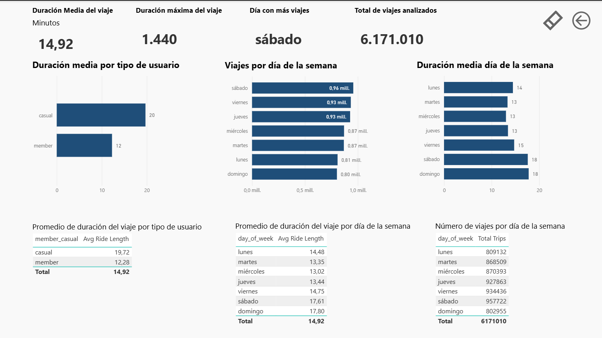
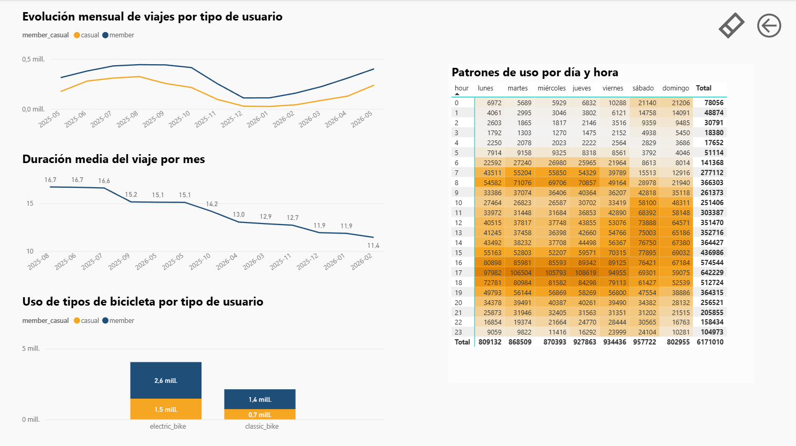

# Cyclistic Bike-Share Analysis — Power BI  

Análisis de 12 meses de datos de uso de bicicletas compartidas para identificar diferencias entre usuarios casuales y miembros, con el objetivo de diseñar estrategias de conversión.

## 📊 Contenido del repositorio  
- Informe Power BI (.pbix)  
- Informe PDF  
- Imágenes de visualizaciones  
- Dataset limpio (si aplica)  

## 🛠️ Herramientas  
- Power BI  
- Power Query  
- DAX  

## 🧠 Objetivo  
Comprender patrones de uso, estacionalidad, duración de viajes y comportamiento por tipo de usuario.

## 🔍 Principales hallazgos  
- Los usuarios casuales realizan viajes más largos.  
- Los fines de semana concentran mayor actividad.  
- Las bicicletas eléctricas son las más utilizadas.  
- Existen picos horarios claros (7–9 h y 16–18 h).

## 📸 Visualizaciones principales

### KPIs generales, duración media por tipo de usuario, viajes por día de la semana y duración media por día de la semana

### Evolución mensual del número de viajes, Duración media mensual, Uso por tipo de bicicletaUso por tipo de bicicleta y patrones de uso por día y hora (heatmap)

## 📁 Nota sobre el archivo .pbix
El archivo original de Power BI no se incluye en este repositorio debido a su tamaño y puede descargarse desde el enlace disponible en mi portfolio de Notion.
